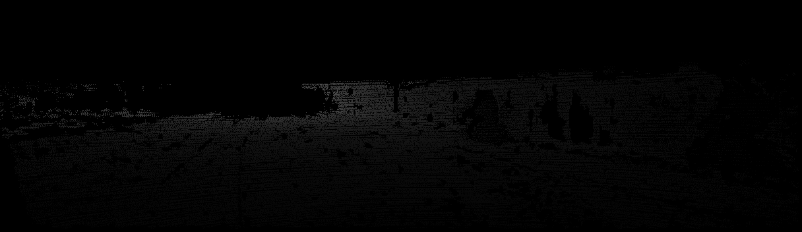

# depth-estimation-with-lidar

## 폴더 구조 (07.07. version)(Keep Changing)
```
├─ .github/workflows            (github actions 관련 파일)
│   └─ black_formatter.yaml    (Black Formatter 적용)
├─ dataset/                     (KITTI 데이터셋, 캘리브레이션 txt, 라이다 raw data, rosbag 등)
│   ├─ ACE/
│   └─ KITTI/
├─ evaluation_using_lidar/      (라이다 데이터를 활용한 추정 결과 평가)
├─ monocular_depth_estimation/  (단안카메라 깊이 추정 모델 관련)
├─ outputs/                     (깊이 추정 결과, lidar 데이터 변환 결과, error 평가 결과 등)
├─ reports/                     (중간 및 최종 보고서, 사용한 이미지)
│   ├─ images/                 (README.md 파일에 사용한 이미지)
│   └─ interim_report-22_07_07.pdf
├─ test/                        (pytest를 위한 test codes)
│   └─ test_code.py
├─ tools/                       (기타 도구 모음)
│   ├─ parsers.py              (commandline parse, calib parse, pcd parse, etc..)
│   ├─ transformations.py      (LiDAR 3D point -> image plane 2D projection)
│   └─ utils.py                (output에 저장하기 등)
├─ .gitignore
├─ main.py                      (전체 파이프라인 실행)
├─ pyproject.toml               (black formatter 등의 configuration)
├─ pytest.ini                   (pytest의 configuration)
├─ README.md
└─ requirements.txt             (프로젝트 수행을 위한 설치 패키지들)
```

## Black Formatter
Black은 Python의 PEP 8을 기본으로 따르는 formatter(코딩 형식 맞춰주는 도구)이다. 추가적으로 imports 문을 위한 formatter인 isort도 있다. 이 두 formatter를 CI로서 GitHub Actions를 통해 자동으로 적용하고자 한다.

Push, Pull Request를 할 때(branch 무관) 자동으로 작동하며, 수동으로 작동시킬 수도 있다(workflow_dispatch).

Actions 탭에서 해당 action의 결과를 볼 수 있으며 여기서 어떤 내용이 바뀌었는지 확인 가능하다. 


이 job이 끝나면 format에 맞도록 자동으로 수정하여 commit을 한다. 단, commit은 이 레포지토리의 소유자인 'EunGiHan'의 계정으로 진행된다.

참고로, 아래는 파이썬 문서 작성의 Google Style 가이드라인이다.
```python
"""모듈 설명 제목

제목
===========

소스코드 첫 시작 부분, import보다 먼저 쓰기
`==`로 제목, `--`로 소제목

.. _참고해야 할 하이퍼링크:
    https://soma0sd.tistory.com/

Attributes:
    module_variable_1(int): 모듈 수준의 변수가 있는 경우 모듈의
      문서화 문자열에 `Attributes:` 섹션을 만들어서 표현합니다.

Example:
    예시를 기록합니다.

Todo:
    * 앞으로 할 것의 목록
    * `Todo`는 모듈이나 패키지, 함수, 클래스 등에 자유롭게
        사용할 수 있습니다.
    * 사용자 입장에서 서술하는 것이 좋습니다.
"""

def function(arg1: int, arg2: str) -> bool:
    """함수 설명 제목

    함수에 대한 설명문

    Args:
        arg1 (int): 사실 함수에 이미 매개변수 형태가 있다면
            굳이 괄호로 표시해 줄 필요는 없습니다.
        arg2: 들여쓰기와 콜론(`:`)이 매개변수와 설명을
            구분합니다.

    Returns:
        bool: 이 경우에도 형태가 소스코드에 이미 있다면
            굳이 반복해서 쓸 필요는 없습니다.

    Raises:
        예외명: 예외의 설명 (예 : 인수가 지정되지 않은 경우에 발생 )

    Yields:
        출력값이 무언가를 나열하는 경우.(리턴값의 데이터형: 리턴값에 대한 설명)

    Examples:

            함수의 사용법 기재

            >>> print_test ("test", "message")
               test message

    Note:
        함께 알아두어야 할 사항이 있는 경우.

    `Args`나 `Returns` 등 각 섹션 사이에는 빈 줄이 하나 필요합니다.
    """
    return True
```

## Outputs (07.07. version)
파일 형식은 `종류-연_월_일-시_분_초.확장자` 형태이다. 

`종류`는 어떤 결과 파일을 저장하고 있는지를 말하며, 종류는 아래와 같다. (추후 변경 및 추가 가능)
* `depth_gt`: LiDAR의 데이터에서 추출한 깊이 정보를 이미지 평면에 투영한 결과. 
* `depth_map`: 단안 카메라 이미지에서 추론한 깊이 추정치.
* `eval_result`: 추정치와 깊이 정보를 바탕으로 평가를 진행한 결과 report(errors)이다. SILog, MASE 등의 수치를 저장한다.

> Note: 위 파일들은 하나의 이미지에 대한 결과값이다.

`확장자`는 어떤 형식으로 파일을 저장할지를 말한다.
* `txt`: 텍스트 파일 형식으로 값을 저장한다.
  * `depth_gt`의 경우, 한 행에 (x, y, depth) 정보를 저장하며, 전체 행의 개수는 한 이미지(시점)에 대해 LiDAR에서 수집한 points의 개수와 같다. (i.e. 한 이미지(시점) 내 전체 포인트의 깊이 정보)
  * `depth_map`의 경우, 한 행에 (x, y, depth) 정보를 저장하며, 전체 행의 개수는 한 이미지에서 뽑아낸 depth 개수와 같다. (픽셀 수) 
  * `eval_result`은 `txt` 형식으로만 저장한다.
* `png`: 이미지 형식으로 값을 저장한다. `depth_gt`와 `depth_map`, 즉 GT값과 추정치를 저장한다.
  * `depth_gt-2022_07_07-16_24_23.png`의 예: <br> 
  * `depth_map-2022_07_07-16_24_23.png`의 예: <br> 
* 기타
  * 필요한 경우 `.pcd` 등의 확장자도 쓰일 수 있다.


## PyTests


## Trashbin
```python

with open(raw_file_path) as raw_file:
    with open(output_file_path, "w") as out_file:
        lines = raw_file.readlines()
        for line in lines:
            lidar_point = line.strip().split(" ")  # TODO TXT를 한 포인트씩 읽어오는 부분 여기에 추가
            lidar_point = [float(p) for p in lidar_point]
            projected_point = project_point(lidar_point, cam_calib, lidar_calib)[
                :-1
            ]  # [x, y]
            y.append(projected_point)
            projected_point_str = " ".join(str(s) for s in projected_point) + "\n"
            out_file.write(projected_point_str)
```