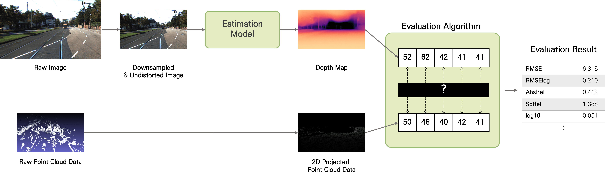
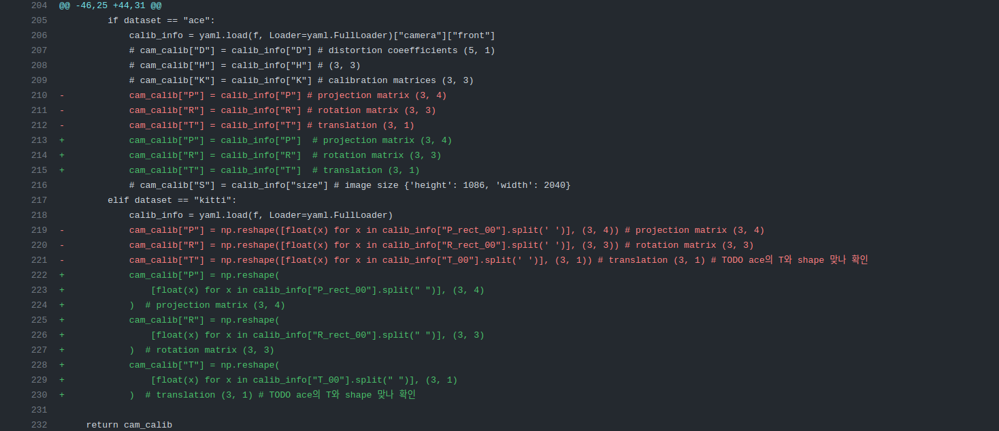

# depth-estimation-with-lidar

## Overview
이 레포지토리는 프로그래머스 자율주행 데브코스 3기의 최종 프로젝트 'Monocular Depth Estimation and Evaluation with LiDAR'의 결과물을 담고있다. 단안 카메라에서 얻은 이미지로부터 픽셀별 깊이값을 추정하고, 추정의 정확도 및 오차를 LiDAR 데이터를 활용하여 평가한다.

아래는 프로젝트의 프로세스(main)를 나타내었다.



아래는 LiDAR point cloud data와 depth 추정 결과를 나타낸 그림이다.


## Requirements
해당 프로젝트 코드를 수행하기 위하여 필요한 패키지들이다.
```
pyyaml  black   isort   pytest  open3d  numpy   ros
```

## Directory Tree
```
├─ .github/workflows            (github actions 관련 파일)
│   └─ black_formatter.yaml    (Black Formatter 적용)
│
├─ dataset/                     (KITTI 데이터셋, 캘리브레이션 txt, 라이다 raw data, rosbag 등)
│   ├─ ACE/
│   └─ KITTI/
│
├─ monocular_depth_estimation/  (단안카메라 깊이 추정 모델 관련)
│
├─ evaluation_using_lidar/
│   └─ evaluation.py            (라이다 데이터를 활용한 추정 결과 평가)
│
├─ outputs/                     (자세한 사항은 [Outputs](#outputs) 참고)
│
├─ reports/                     (중간 및 최종 보고서, 사용한 이미지)
│   ├─ images/                  (README.md 파일에 사용한 이미지)
│   ├─ interim_report-22_07_07.pdf      (중간 보고서)
│   ├─ final_report-22_07_15.pdf        (최종 보고서)
│   └─ final_presentation-22_07_15.pdf  (최종 발표 자료)
│
├─ sync_lidar_camera            (rosbag으로부터 raw data를 추출하기)
│
├─ test/                        (pytest를 위한 test codes)
│   └─ test_code.py
│
├─ tools/                       (기타 도구 모음)
│   ├─ parsers.py              (commandline parse, calib parse, pcd parse, etc..)
│   ├─ transformations.py      (LiDAR 3D point -> image plane 2D projection)
│   └─ utils.py                (output에 저장하기 등)
│
├─ .gitignore
├─ main.py                      (전체 파이프라인 실행)
├─ pyproject.toml               (black formatter 등의 configuration)
├─ pytest.ini                   (pytest의 configuration)
└─ README.md
```

## Outputs
코드를 구동하며 `outputs` 폴더에 저장하는 파일들은 아래와 같다. 상세한 디렉터리 구조는 `outputs` 폴더의 `README.md`에 기록해두었다. 각 저장 파일들은 하나의 이미지(한 프레임)에 대한 값이다.

* rosbag에서 데이터 추출하기 (`sync_lidar_camera` 패키지)
  * `raw_pc/<frame_num>.npy`
  * `raw_img/<frame_num>.npy`
* 왜곡 보정한 이미지
  * `undist_img/<frame_num>.png`
* LiDAR point cloud data를 이미지 평면에 투영하기
  * `depth_gt/depth_gt-<frame_num>.npy` : 이미지 평면으로 투영된 결과 배열. 한 행에 (x, y, depth) 정보를 저장하며, 전체 행의 개수는 한 이미지(시점)에 대해 LiDAR에서 수집한 points의 개수와 같다. (i.e. 한 이미지(시점) 내 전체 포인트의 깊이 정보)
  * `depth_gt/depth_gt-<frame_num>.png` : 이미지 평면으로 투영하여 깊이를 grayscale로 저장
  * `depth_gt/projection-<frame_num>.png` : point cloud를 이미지 위에 투영하여 함께 나타냄
* 모델을 통해 깊이를 추정하기
  * `depth_map/depth_map-<frame_num>.npy` : 추정한 깊이 배열. 한 행에 (x, y, depth) 정보를 저장하며, 전체 행의 개수는 한 이미지에서 뽑아낸 depth 개수와 같다. (픽셀 수)
  * `depth_map/depth_map-<frame_num>.png` : 추정한 깊이를 시각화한 이미지
* 추정 결과를 평가하기
  * `eval_result.txt` : 각 프레임에 대한 추정치의 정확도를 평가하고, 모든 프레임에 대해 평균한 결과를 저장한 텍스트 파일


## Black Formatter
Black은 Python의 PEP 8을 기본으로 따르는 formatter(코딩 형식 맞춰주는 도구)이다. 추가적으로 imports 문을 위한 formatter인 isort도 있다. 이 두 formatter를 CI로서 GitHub Actions를 통해 자동으로 적용하고자 한다.

Push, Pull Request를 할 때(branch 무관) 자동으로 작동하며, 수동으로 작동시킬 수도 있다(workflow_dispatch).

Actions 탭에서 해당 action의 결과를 볼 수 있으며 여기서 어떤 내용이 바뀌었는지 확인 가능하다. 



이 job이 끝나면 format에 맞도록 자동으로 수정하여 commit을 한다. 단, commit은 이 레포지토리의 소유자인 'EunGiHan'의 계정으로 진행된다.

참고로, 아래는 파이썬 문서 작성의 Google Style 가이드라인이다.
```python
"""모듈 설명 제목

제목
===========

소스코드 첫 시작 부분, import보다 먼저 쓰기
`==`로 제목, `--`로 소제목

.. _참고해야 할 하이퍼링크:
    https://soma0sd.tistory.com/

Attributes:
    module_variable_1(int): 모듈 수준의 변수가 있는 경우 모듈의
      문서화 문자열에 `Attributes:` 섹션을 만들어서 표현합니다.

Example:
    예시를 기록합니다.

Todo:
    * 앞으로 할 것의 목록
    * `Todo`는 모듈이나 패키지, 함수, 클래스 등에 자유롭게 사용할 수 있습니다.
    * 사용자 입장에서 서술하는 것이 좋습니다.
"""

def function(arg1: int, arg2: str) -> bool:
    """함수 설명 제목

    함수에 대한 설명문

    Args:
        arg1 (int): 들여쓰기와 콜론(`:`)이 매개변수와 설명을 구분합니다.

    Returns:
        bool: 리턴 내용을 설명합니다.

    Raises:
        예외명: 예외의 설명 (예 : 인수가 지정되지 않은 경우에 발생 )

    Yields:
        출력값이 무언가를 나열하는 경우.(리턴값의 데이터형: 리턴값에 대한 설명)

    Examples:
            함수의 사용법 기재

            >>> print_test ("test", "message")
               test message

    Note:
        함께 알아두어야 할 사항이 있는 경우.

    `Args`나 `Returns` 등 각 섹션 사이에는 빈 줄이 하나 필요합니다.
    """
    return True
```